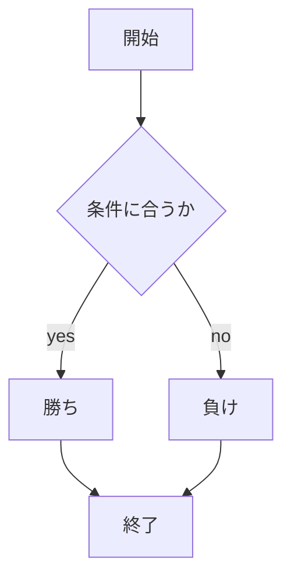
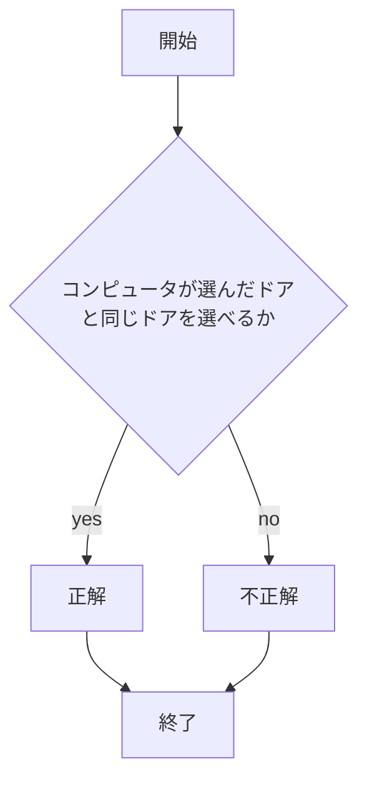
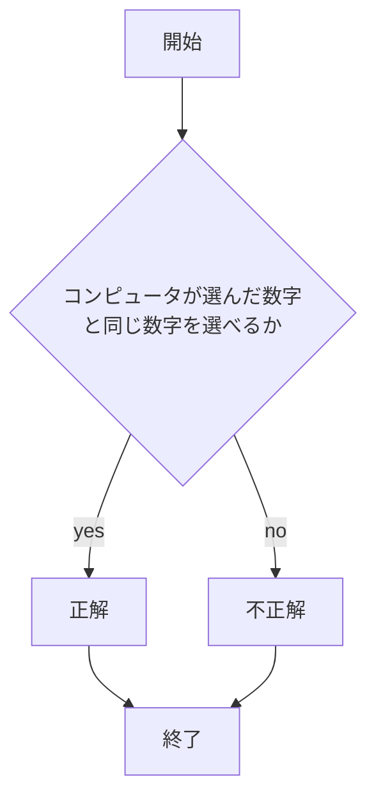

# webpro_06
## jankenについて
## ファイル一覧
ファイル名 |　説明
-|-
app5.js| プログラム本体
public/janken.html|ジャンケンの開始画面
views/janken.ejs|ジャンケンのテンプレートファイル

1. ファイルWebpro_06を開いて```node app5.js```でプログラムを起動する
1. Webブラウザでlocalhost:8080/public/janken.htmlにアクセスする
1. 自分の手を入力する

## chooseについて
##　 ファイル一覧
ファイル名 | 説明
-|-
app5.js| プログラム本体
public/choose.html| ドアを選ぶ画面のファイル
views/choose.ejs| 正解か不正解を表示する画面のファイル

1. ファイルWebpro_06を開いて```node app5.js```でプログラムを起動する
1. Webブラウザでlocalhost:8080/public/choose.htmlにアクセスする
1. 右か左のドアを選択する
1. 右か左と入力し選択したドアがコンピュータが選んだドアと同じなら正解と表示される
1. コンピュータと違うドアなら不正解と表示される



## numberについて
## ファイル一覧
ファイル名 |　説明
-|-
app5.js|プログラム本体
public/number.html|数字を選択する画面のファイル
views/number.ejs|正解か不正解と正解の数字を表示する画面のファイル

1. ファイルWebpro_06を開いて```node app5.js```でプログラムを起動する
1. Webブラウザでlocalhost:8080/public/number.htmlにアクセスする
1. 1~5の中から数字を選ぶ
1. コンピュータが選んだ数字と一致すれば正解と表示される
1. コンピュータが選んだ数字と一致しなければ不正解と表示される


